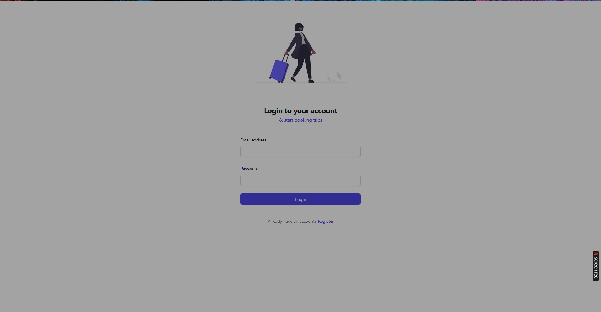
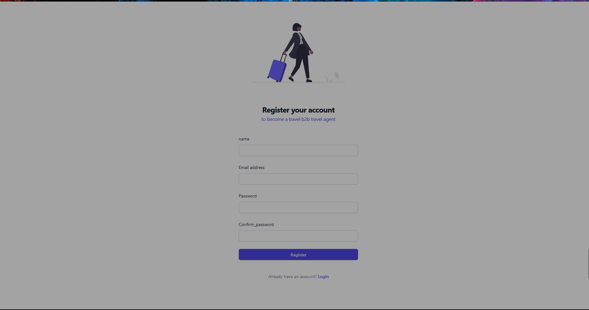

Overview

Interview Round 1 of 3: Remote Practical Assignment

Table of Contents

    Introduction
    Installation
    Usage
    Project Structure
    Contributing
    License

Introduction

    
    

Installation
 
Please note i used yarn package manage to spin up this project. For some reason npm has legacy peer dependecy issues.

    ```cd project```
    ```composer install```
    ```php artisan migrate```
    ```yarn```
    ```yarn dev```

Access project at ``127.0.0.1:8000```

    >>> Make sure to Register a travel agent first.


php

project/
│
├── backend/              # Backend Laravel code
│   ├── app/              # Laravel application files
│   ├── database/         # Database migrations and seeds
│   └── ...
│
├── frontend/             # Frontend Vue.js code
│   ├── src/              # Vue.js source files
│   ├── public/           # Public assets
│   └── ...
│
└── docs/                 # Documentation files
